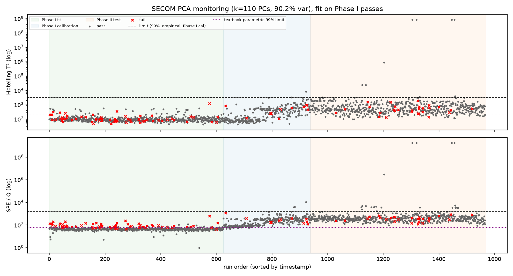
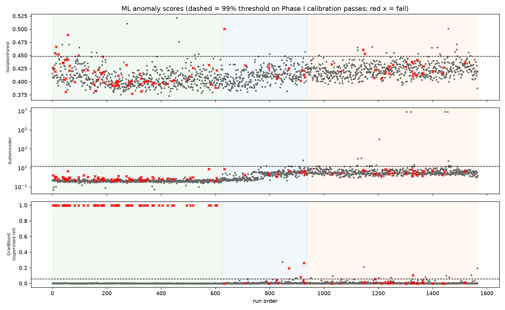
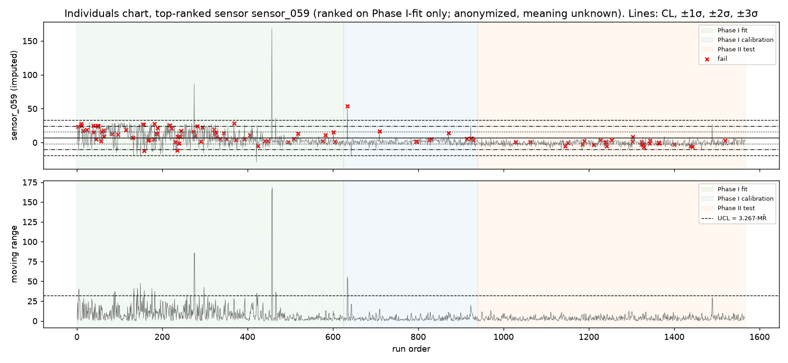
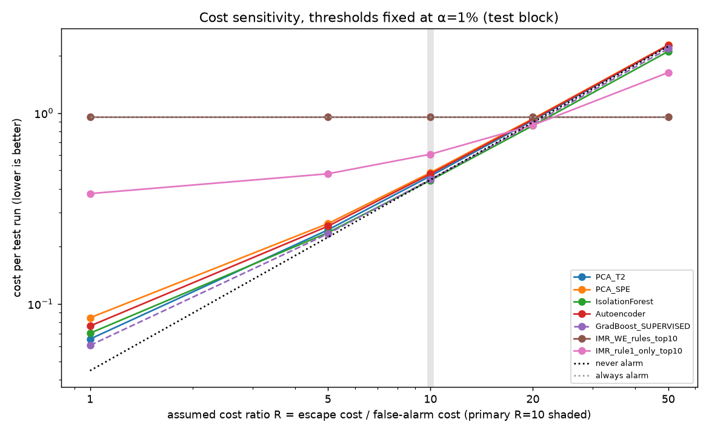
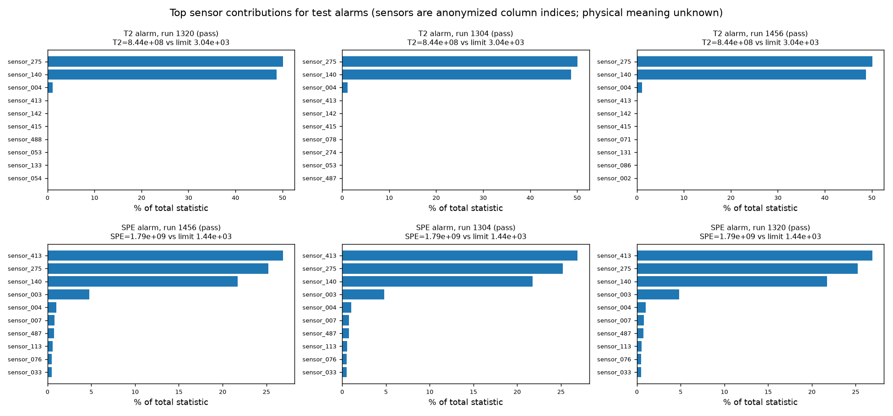
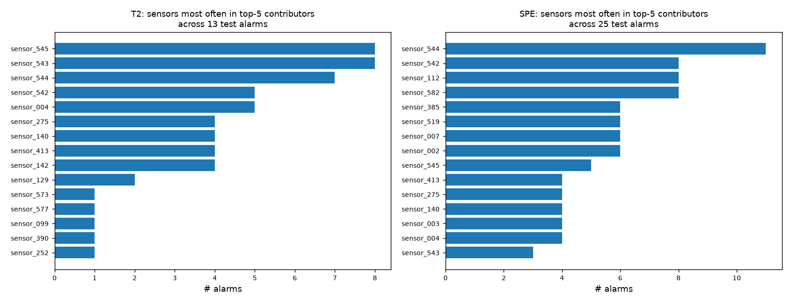

# secom-spc-vs-ai (v0)

**Question:** on real semiconductor fab data, do machine-learning anomaly detectors catch failing production runs better than
classic statistical process control (SPC) charts at the same false-alarm budget?

**Who this is for:** a process or quality engineer who needs to decide whether ML alarms beat control charts before trusting them.
That means comparing at an equal, calibrated false-alarm rate on a time-ordered holdout, with a cost view and with "where to look" contribution plots.

Data: [UCI SECOM](https://archive.ics.uci.edu/dataset/179/secom), 1,567 production runs, 590 anonymized sensor signals,
pass/fail label + timestamp, collected Jul–Oct 2008. Real data only, nothing synthetic.

The study design (split, metrics, limits, cost ratio, decision rule) was fixed in [`PREREGISTRATION.md`](PREREGISTRATION.md) and tagged
`prereg` before any method was run. The `prereg` commit comes before every results commit in the history.

## Likely honest outcome (stated in the preregistration before running)

Control charts may well tie or beat ML here, and no method may beat "never alarm" on cost. Either outcome would be the finding, not a failure.
The supervised gradient-boosting row is an **upper-bound reference that uses labels**, never a competitor.

## Reproduce

```bash
pip install -r requirements.txt   # numpy pandas scipy scikit-learn matplotlib
make all                          # = python -m secom.data && python -m secom.run && python -m secom.report
```

`make all` downloads the zip from UCI, checks it against the SHA-256 values in `data/MANIFEST.json`, runs every method with fixed seeds
(CPU only, ~1 min), writes `results/results.json`, and regenerates `figures/*.png` and the tables below from that JSON.

## Results

<!-- RESULTS:START -->
<!-- RESULTS:END -->

How to read it:
- **Detection rate** = share of the 28 test fails that alarmed on the failing run itself. **False-alarm rate** = share of test passes that alarmed.
- **ARL0** = average number of passing runs between false alarms. Bigger is better: it's how often an engineer gets pulled for nothing.
- **ARL1 / delay** = runs from a fail until the first alarm (delay 0 = alarmed on that run). At a ~1% false-alarm rate, *some* alarm shows up within about 100 runs anyway,
  so delay only means something next to ARL0.
- **Cost** = (R·missed fails + false alarms) / test runs, with **R = 10 as an assumption**, not a measured fab cost. Compare each row to *never alarm*.

INTERPRETATION_PLACEHOLDER

## Figures

| | |
|---|---|
|  |  |
|  |  |
|  |  |

Contribution plots show which sensors push T² or SPE over the limit for a given alarm (T²: c_j = x_j·(PΛ⁻¹Pᵀx)_j; SPE: c_j = e_j²).
All test alarms are in `results/contributions_test_alarms.csv`. **The sensors are anonymized in the public dataset.** `sensor_NNN` is just the 0-based column
in `secom.data`. The plots tell an engineer *which channel* to pull up, not what that channel physically measures. We don't guess at meanings.

## Data, split, and missing values

<!-- DATA:START -->
<!-- DATA:END -->

## Methods (details in PREREGISTRATION.md)

- **Classic SPC:** PCA fit on Phase I passing runs → Hotelling T² and SPE/Q charts, with 99% limits from held-out Phase I calibration passes
  (textbook F / Jackson–Mudholkar limits also reported). Plus univariate **I-MR charts** on the 10 sensors ranked most fail-related on Phase I-fit only, with
  Western Electric rules 1–4 + MR-chart signal. Those are reported uncalibrated, the way a shop-floor chart wall runs.
- **ML, unsupervised:** Isolation Forest (500 trees) and a small MLP autoencoder (64-16-64), both fit on Phase I passing runs only. Thresholds come from the same
  99% calibration rule as T²/SPE.
- **ML, supervised (upper-bound reference, uses labels):** histogram gradient boosting trained on Phase I-fit runs *with* pass/fail labels. It's a
  ceiling, not a fair competitor: in a fab, labels arrive late and fails are rare.

## Limitations (plainly)

- **Old, small, single-source data.** One public dataset from one fab, from 2008, covering about three months. Results may not carry over to other tools, products or fabs.
- **Anonymized sensors.** No physical meaning, units or process step is known, so contribution plots can't be checked against engineering knowledge.
- **Class imbalance and tiny test positives.** 104 fails total and only 28 in the test block, so each test fail moves the detection rate by about 3.6 points.
  The confidence intervals are wide. Read differences of a few detections as noise.
- **Label semantics.** "Fail" is an in-house line-testing outcome for the run. It isn't a confirmed root-caused excursion, and many fails may not be visible in these sensors at all.
- **Drift.** The process visibly drifts after Phase I (see the T²/SPE chart). A static Phase I model will drift into alarming more over time. The fixed-α comparison
  captures this honestly but doesn't explore re-baselining (left for later).
- **Single split, single seed.** No rolling-origin or repeated evaluation in v0.
- **Cost ratio is assumed** (R = 10), so a sweep over R = 1–50 is shown instead of claiming one true number.

## Deviations from preregistration

See [`DEVIATIONS.md`](DEVIATIONS.md). It logs everything that touched the data before the `prereg` tag (descriptive checks and a training-period-only code smoke test) and any change after it.

## Layout

```
secom/data.py        download + checksum manifest + time-ordered loader
secom/preprocess.py  missing-value audit, Phase-I-only imputation/scaling
secom/methods.py     PCA T²/SPE (+contributions, parametric limits), I-MR + WE rules, IsolationForest, autoencoder, gradient boosting
secom/metrics.py     detection rate, FAR, ARL0, delay/ARL1, cost, Wilson CIs
secom/run.py         runs everything -> results/
secom/report.py      figures/ + README tables from results/results.json
```

License for the code: MIT. Data: UCI SECOM (CC BY 4.0 per UCI listing), not redistributed here.
